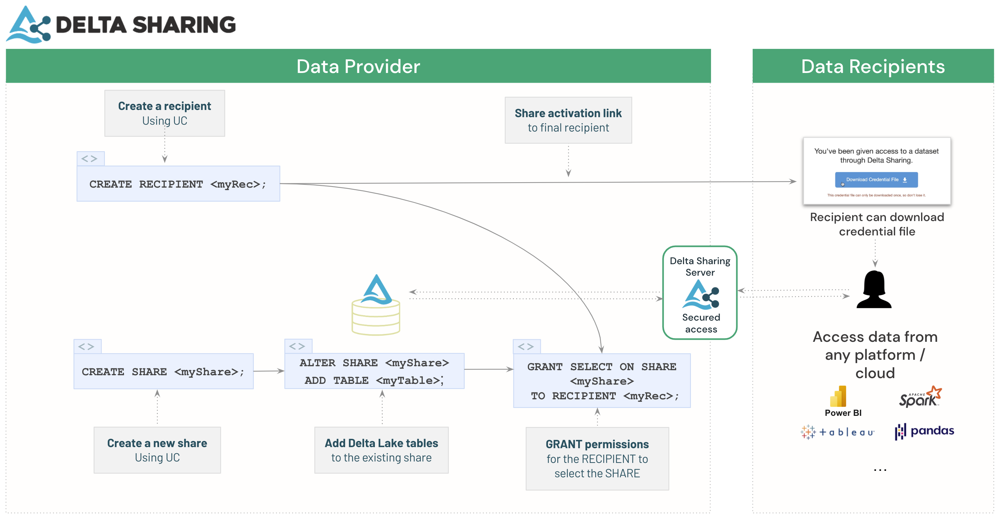

# Sharing Data Across Cloud and Organizations

Having a centralized data platform managed centrally and used throughout the organization presents many advantages. It lowers the infrastructure and maintenance costs, ensures that data access isn't blocked by technicall barriers or manual processes, and fosters cross-functionnal collaboration and innovation. It is a nice ideal to have in data management.

However, the reality of most organizaitons can be quite far away from it. It is not rare to see subsequent teams pursuing this ideal centralized data platform, only to end up creating a new one that in the future will need to be stitched to all the other existing systems.

Why? Mostly, simply because migrations are costly. Migrations don't only require to move data, but all the softwares and processes associated with it. This means that it's very easy to underestimate the cost of a migration, and it's often just not worth changing an existing working system.

In practice, this often means that multi-cloud and multi-technology is a long-term reality for many customers, and in this reality a new paradigm has emerged to gather a centralized intelligence through different : the data mesh architecture.

## The Data Mesh Architecture

The Data Mesh Architecture is a new paradigm that has emerged to address the challenges of managing data in a multi-cloud and multi-technology environment. It aims to decentralize data ownership and enable cross-functional collaboration by treating data as a product. In a data mesh architecture, data is treated as a first-class citizen and is owned and managed by individual domain teams. These teams are responsible for the quality, availability, and discoverability of their data products. The architecture promotes the use of self-serve data infrastructure and tools, allowing teams to independently build, deploy, and operate their data products. This approach reduces the reliance on centralized data platforms and enables organizations to scale their data capabilities more effectively.

Databricks and delta sharing are enablers of this kind of architecture. 

## Setup

This tutorial will guide you through the process of sharing data across two Databricks instances, one on Azure and another on GCP, and then also with a BigQuery Table, to be served in a single table.
.png)

### About the data

We are here using a sample demo dataset of flights. 
- The 2007 Flights have been confined to a BigQuery Dataset System
- The 2008 Flights in an GCP Databricks Environment
- The description of the airlines are in an Azure Databricks environment.

And of course we want to join these different data to extract some intelligence.

In real life, you are likely to have more than one dataset. However this data product to be shared, per the guidelines of the Data Mesh architecture, should remain moderate in size with considerations of performance and cross-cloud egress costs.

## Prerequisites

- An active Azure with an Existing Delta Lake
- An active GCP with an Existing Delta Lake
- An Active GCP with existing tables in BigQuery

## Step 1: Set up a Share in Azure Databricks

Here is the flow describing how to build a data product leveraging Delta Sharing using a table as a base.

## Step 2: Connect an Existing BQ Dataset through Query Federation

1. In your GCP Databricks workspace, create a Connection object leveraging a GCP SA identity.
2. Grant rights to this Connection, and create an external catalog based on it
3. Query the data from this catalog

## Step 3: Combine Data in Databricks SQL

In this last step we just need to run the unified query in Databricks SQL and biuld an associated Dashboard leveraging the connection to all three data sources.

In real life, this step might take a little time, as different data might have clashing formatting or typping constraints

